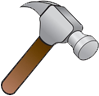

# 💡 Bem vindo ao exercício Lâmpada! 💡
### Eu desenvolvi uma página em HTML para um pequeno exercício de uso de JavaScript.
Esse exercício consiste em 4 coisas:
1. Arraste o mouse por cima da lâmpada para ligar
2. Remova o mouse de cima da lâmpada para apagar
3. Clique na lâmpada para quebrá-la
4. Clique no &ensp;&ensp; para consertar

---

Você pode acessar a página do meu exercício 
<a href="https://georgeenriquebravo.github.io/Lampada/" target="_blank">
    clicando aqui
</a>
.

---

# Tecnologias Utilizadas 
Nesse projeto foram utilizadas as seguintes tecnologias:

    
    
    

